# 🚚 Curierul Perfect Assistant

> Chrome/Edge MV3 extension for monitoring Romanian transport Facebook groups.  
> Detects posts with **"caut"** keyword → queues for review → auto-types promotional comments.

---

## 📁 File Structure

```
├── background.js      # Service worker: alarms, tabs, message routing
├── checkForNewPost.js # Feed scanner (injected dynamically)
├── content.js         # Comment auto-typer (auto-injected on FB groups)
├── popup.html/js      # Extension UI
├── styles.css         # Popup styling
└── manifest.json      # Extension config (MV3)
```

---

## 🔄 Data Flow

```mermaid
graph LR
    A[⏰ Alarm 5min] --> B[Open hidden tab]
    B --> C[Inject checkForNewPost.js]
    C --> D[Scroll & scan feed]
    D --> E{Contains 'caut'?}
    E -->|Yes| F[Store in pendingPosts]
    E -->|No| G[Skip]
    F --> H[🔔 Notification]
    H --> I[User clicks 'Deschide']
    I --> J[content.js auto-types comment]
```



### Storage Keys
| Key | Type | Purpose |
|-----|------|---------|
| `pendingPosts` | Array | Posts awaiting action |
| `seenPostIds` | Array | Deduplication tracking |
| `commentText` | String | Comment for auto-typing |

---

## ⚠️ Critical Patterns

### ⚡ Groups Array Sync
> **MUST update both files when adding groups!**

```javascript
// background.js L2-5 AND popup.js L2-5
const groups = [
  { name: "Display Name", url: "https://www.facebook.com/groups/ID" }
];
```

### 🎯 React-Compatible Text Insertion
```javascript
// DON'T use innerText - React won't detect changes!
box.focus();
const sel = window.getSelection();
const range = document.createRange();
range.selectNodeContents(box);
range.collapse(false);
sel.removeAllRanges();
sel.addRange(range);
document.execCommand("insertText", false, text);
box.dispatchEvent(new Event('input', { bubbles: true }));
```

### 🔍 Comment Box Selector
```javascript
const boxes = document.querySelectorAll('[contenteditable="true"][role="textbox"]');
// Validate: box.offsetParent !== null
// Context: aria-label includes "comment", "write", or "scrie"
```

---

## ⏱️ Timing Reference

| Location | Value | What it controls |
|----------|-------|------------------|
| `background.js` | `5 min` | Check interval (alarm) |
| `background.js` | `30s` | Delay between groups |
| `background.js` | `100s` | Tab lifetime before close |
| `checkForNewPost.js` | `20s` | Initial page load wait |
| `checkForNewPost.js` | `5s × 12` | Scroll interval (60s total) |
| `content.js` | `30` | Max seconds to find comment box |

---

## 🔎 Post Detection Logic

**File:** `checkForNewPost.js`

1. **Age filter** → `isTimeWithinRange()` → ≤12 hours
2. **Keyword filter** → `containsTransportKeywords()` → must contain `"caut"`
3. **Dedup** → `seenPostIds` Set prevents re-processing

**URL Extraction Priority:**
1. Timestamp links (`2m`, `5h`) — these ARE permalinks
2. Pattern: `/groups/\d+/posts/` or `/permalink/`
3. `story_fbid` query params
4. Construct from `pfbid` in HTML

---

## 🛠️ Development

### Load Extension
```
chrome://extensions → Developer Mode → Load unpacked → select folder
```

### Debug Locations
| Component | Where to debug |
|-----------|----------------|
| Popup | Click extension icon → right-click → Inspect |
| Content script | Facebook page → DevTools Console |
| Background | `chrome://serviceworker-internals` |

### No Build System
Vanilla JS — edit files directly, click **"Update"** in chrome://extensions.

---

## 📝 Conventions

| Aspect | Convention |
|--------|------------|
| **Language** | Romanian (UI & comments) |
| **Promoted site** | `curierulperfect.com` |
| **Logging** | Emoji-prefixed: 🚀 ✅ ❌ ⏰ 📝 |
| **Comments array** | `randomMessages` in popup.js |
